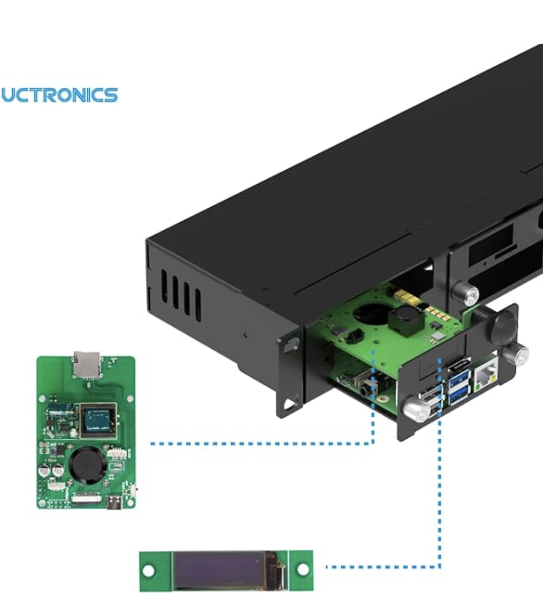

## Overview

Utronics sells [a rackmount kit](https://www.amazon.com/UCTRONICS-Raspberry-Rackmount-Functionality-Compatible/dp/B09V1DH7VS) for rasberry pi's.  

The fixture has a small screen which is labeled UC-776 Rev B.  This is probably Utronics internal model number as a quick google search doesn't return any devices with that model number.



This device seems to be a SSD1306 128x32 oled screen.  I'm making some assumptions given what it looks like as compared to other devices
as well as references to SSD1306 in the [C code base](https://github.com/UCTRONICS/U6143_ssd1306/blob/master/C/ssd1306_i2c.c#L24C13-L24C13). 

Further inspection of the C package reveals that there's an initialization routine for the device.  Interfacing with the 
device requires connecting to the I2C address for the oled screen.  

> **Note** I2C stands for Inter-Integrated Circuit (I2C).
> There's a good tutorial on I2C which can be found here: https://learn.adafruit.com/scanning-i2c-addresses/i2c-basics

Looking around, there's already an I2C golang package for generally interfacing with an I2C device.  Hopefully
now it's just a matter of writing and reading the correct values to the device. 

### Device Address and I2C bus allocation

```bash
$ i2cdetect -y 1
     0  1  2  3  4  5  6  7  8  9  a  b  c  d  e  f
00:                         -- -- -- -- -- -- -- --
10: -- -- -- -- -- -- -- -- -- -- -- -- -- -- -- --
20: -- -- -- -- -- -- -- -- -- -- -- -- -- -- -- --
30: -- -- -- -- -- -- -- -- -- -- -- -- 3c -- -- --
40: -- -- -- -- -- -- -- -- -- -- -- -- -- -- -- --
50: -- -- -- -- -- -- -- -- -- -- -- -- -- -- -- --
60: -- -- -- -- -- -- -- -- -- -- -- -- -- -- -- --
70: -- -- -- -- -- -- -- --
```
